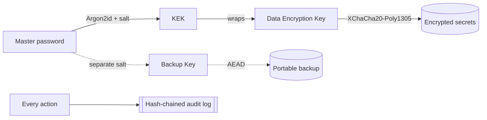

<h1 align="center">🔐 Kosh</h1>

<p align="center">
  <strong>Kosh is an air-sealed, offline secrets manager for your API keys, tokens, and passwords.</strong><br>
  A local-first, open-source API-key &amp; credential manager — one encrypted database on your machine, with no cloud, no account, and no network by design.
</p>

<p align="center">
  
  
  
  
  
  
</p>

<p align="center"><em>कोश — Sanskrit for the treasury that safeguards what's valuable.</em></p>

> **Your secrets never leave your machine — and nothing on your machine can ask for them except you.**
> No CLI, no local server, no MCP endpoint, no AI-tool hook. That attack surface doesn't exist; it was removed by construction, and a build-time test keeps it that way.

---

## ⬇️ Try Kosh

Download the latest build from the [**Releases**](https://github.com/deepakvamsi/kosh/releases/latest) page:

| Platform | Download |
|----------|----------|
| **Windows** 10/11 (x64) | `Kosh-<version>-windows-amd64-setup.exe` (installer) — or the portable `Kosh-<version>-windows-amd64.exe` |
| **Linux** (x64, Debian/Ubuntu) | `kosh_<version>_amd64.deb` — or the portable `Kosh-<version>-linux-amd64` |

Builds are produced automatically by CI ([`.github/workflows/release.yml`](.github/workflows/release.yml)) on every `v*` tag. Prefer to build it yourself? See [Install](#-install).

**Verify your download.** Each release ships a `SHA256SUMS` file. Compare it against your download:

```bash
# Windows (PowerShell)
Get-FileHash .\Kosh-<version>-windows-amd64.exe -Algorithm SHA256
# Linux / macOS
sha256sum Kosh-<version>-linux-amd64
```

> **First-run warning on Windows.** Until releases are code-signed you may see Windows SmartScreen say *"Windows protected your PC / unknown publisher."* That reflects the *absence of a paid signing certificate*, not a problem with the app — verify the checksum above and choose **More info → Run anyway**. Signed builds (no warning) are on the roadmap.

---

## The problem

Your credentials are scattered and unprotected right now:

- Plaintext `.env` files sitting in a dozen repos.
- API keys and tokens strewn across **spreadsheets**, shell history, Slack DMs, and sticky notes.
- Cloud secret managers that demand an account, a network round-trip, and trusting someone else's server with your keys.
- No record of *when* a key was last used, *whether* it's expired, or *if* you're holding three copies of the same one.

## What Kosh is

A single desktop app that keeps every credential in one **encrypted local database**, unlocked by one master password, and readable **only through the app's own UI — one reveal at a time, every reveal written to a tamper-evident log.** It runs identically on Windows, macOS, and Linux, and it makes **zero network connections** — a property enforced by a test that fails the build if any package so much as imports `net/http`.

Pull your keys out of a dozen spreadsheets and into one treasury that actually protects them.

---

## ✨ Highlights

| | |
|---|---|
| 🔑 **Envelope encryption** | An Argon2id-derived Key-Encryption-Key wraps a random Data-Encryption-Key; secret values are sealed with XChaCha20-Poly1305 AEAD. Nothing is stored in plaintext. |
| 🗂️ **Typed items** | Store API keys, full **logins** (username + password), and **secure notes**. Every sensitive field — the username included — is encrypted inside the value blob; none of it touches a queryable column. |
| 🧾 **Tamper-evident audit log** | Every action is a hash-chained record — edit or delete one entry and `VerifyChain()` pinpoints exactly where the chain broke. |
| 📴 **Air-sealed** | No cloud, no login server, no telemetry, no listener. A build-time guard (`internal/seal`) rejects any networking import so the offline guarantee can't silently regress. |
| 👁️ **Names without values** | Browse *which* secrets you have (`OPENAI_PROD`, `AWS_STAGING`) without decrypting a single value; decryption happens only on an explicit, audited reveal. |
| 🩺 **Credential health** | Flags expired, expiring-soon, unused, stale, and duplicate credentials so you actually rotate them. |
| 🔒 **Auto-lock, enforced in the core** | The in-memory key is wiped on idle by the Go backend itself — not just a UI timer — so a frozen or bypassed frontend can't keep the vault open. |
| 📸 **Screen-capture exclusion** | The window is excluded from screenshots/recorders on Windows (`WDA_EXCLUDEFROMCAPTURE`) and macOS. |
| 📦 **Portable encrypted backups** | Authenticated, self-contained archives you can restore onto a fresh machine — full vault, folders, tags, and custom fields included. |
| 📥 **One-shot spreadsheet import** | Migrate from an `.xlsx`/`.csv` locally; the file is parsed in-process, encrypted into the vault, and you're prompted to delete the source. |

---

## 🆚 Why not just…

| | `.env` / spreadsheets | Cloud secret managers | HashiCorp Vault | **Kosh** |
|---|:---:|:---:|:---:|:---:|
| Works fully offline | ✅ | ❌ | ❌ | ✅ |
| No account / no server to run | ✅ | ❌ | ❌ | ✅ |
| Encrypted at rest | ❌ | ✅ | ✅ | ✅ |
| Per-secret, audited access | ❌ | ⚠️ | ✅ | ✅ |
| Tamper-evident log | ❌ | ⚠️ | ✅ | ✅ |
| No queryable API to exfiltrate through | ❌ | ❌ | ❌ | ✅ |
| Zero network by design | ✅ | ❌ | ❌ | ✅ |
| Desktop UX for humans | ❌ | ✅ | ❌ | ✅ |

Kosh isn't trying to be a cloud platform or a service mesh. It's the vault for the keys that live on *your* laptop.

---

## 🔒 Security at a glance

| Property | How it's achieved |
|---|---|
| Password-based key derivation | **Argon2id** (memory-hard), per-vault random salt, tunable cost stored in the vault header |
| Authenticated encryption | **XChaCha20-Poly1305**; each value's ciphertext binds its row id + provider + environment as associated data |
| Key hierarchy | Master password → **KEK** (Argon2id) → wraps random **DEK** → encrypts secrets. The DEK exists in memory only while unlocked. |
| Audit integrity | Append-only log, `hash = SHA-256(prev_hash ‖ record)` |
| Offline guarantee | `internal/seal` build-time test forbids networking imports across the whole module |
| At-rest hardening | OS-level DACL/permission lockdown on the database file |

> **Honest by policy:** Kosh implements well-reviewed primitives and controls that **map to** SOC 2 criteria. It is *not* "military grade" and *not* "SOC 2 certified" — certification is an organizational audit, not a property of software. Full analysis in [`docs/THREAT_MODEL.md`](docs/THREAT_MODEL.md).



---

## 🚀 Install

Pre-built downloads live on the [Releases](https://github.com/deepakvamsi/kosh/releases/latest) page — see [Try Kosh](#️-try-kosh) above. To build it yourself:

### Prerequisites (to build from source)

| Tool | Version | Install |
|------|---------|---------|
| Go | 1.25+ | https://go.dev/dl/ |
| Node.js + npm | 18+ | https://nodejs.org/ |
| Wails CLI | v2 | `go install github.com/wailsapp/wails/v2/cmd/wails@latest` |

Platform webview / build deps:

```bash
# Windows: WebView2 ships with Windows 10/11 (nothing to install).

# macOS:
xcode-select --install

# Debian / Ubuntu:
sudo apt install build-essential libgtk-3-dev libwebkit2gtk-4.0-dev

# Fedora:
sudo dnf install gtk3-devel webkit2gtk4.0-devel
```

Verify your toolchain:

```bash
wails doctor
```

Optional, for packaging: **NSIS** (bundled installer via `wails build -nsis`), **WiX v4**
(`dotnet tool install --global wix`, for the MSI), and **Python + Pillow**
(`pip install pillow`, to regenerate icons with `scripts/gen_icons.py`).

### Build

```bash
cd cmd/localvault
wails build                                  # native desktop binary → build/bin/Kosh.exe
wails build -platform windows/amd64 -nsis    # + Windows installer
```

---

## 🧑‍💻 Quick start

1. **Launch** Kosh and set a strong master password (12+ characters). This creates your encrypted vault — the password is never stored.
2. **Add a secret** — give it an alias (`STRIPE_PROD`), pick a provider and environment, paste the value. It's encrypted immediately. (Or **import** an existing spreadsheet in one pass.)
3. **Reveal on demand** — click reveal or copy when you need it. Every reveal is logged; the clipboard auto-clears.

Your vault lives at:
```
Windows: %APPDATA%\Kosh\vault.db
macOS:   ~/Library/Application Support/Kosh/vault.db
Linux:   ~/.local/share/Kosh/vault.db
```

### Upgrading keeps your data

Your secrets live in `vault.db` in the OS user-data path above — **not** inside the
app install folder. Installing a newer version (or replacing the portable `.exe`)
does **not** touch that file, so **your vault, master password, and all secrets
persist across upgrades**. On first launch after an upgrade, Kosh applies any
pending schema migrations to the existing `vault.db` in place; nothing is
re-created and nothing is lost. To start over deliberately, use
**Settings → Reset Vault** (this permanently deletes `vault.db`).

---

## 🏗️ How it works

```
cmd/localvault/       Wails desktop app (Go backend + React/TS frontend)
internal/
  crypto/             Argon2id KDF, XChaCha20-Poly1305 AEAD, envelope keys
  storage/            Pure-Go SQLite (modernc.org/sqlite), schema + migrations
  vault/              Domain core: unlock/lock, secret CRUD, folders, tags
  audit/              Tamper-evident, hash-chained audit log
  health/             Expiry / staleness / duplicate detection
  backup/             Encrypted, portable backups
  importer/           One-time Excel/CSV import
  seal/               Build-time network air-seal guard
docs/                 Architecture, threat model, crypto design, schema
```

Deep dives: [Architecture](docs/ARCHITECTURE.md) · [Threat Model](docs/THREAT_MODEL.md) · [Cryptographic Design](docs/CRYPTO.md) · [Database Schema](docs/DB_SCHEMA.md) · [Roadmap](docs/ROADMAP.md)

---

## 🧰 Tech stack

**Go** (core + crypto) · **Wails v2** (native desktop shell) · **React + TypeScript + Tailwind** (UI) · **modernc.org/sqlite** (pure-Go, no CGO) · **golang.org/x/crypto** (Argon2id, XChaCha20-Poly1305, BLAKE2b).

**Transparency:** every dependency — Go and npm — with its purpose, license, and source link is listed in [`DEPENDENCIES.md`](DEPENDENCIES.md).

---

## 🗺️ Roadmap

See [`docs/ROADMAP.md`](docs/ROADMAP.md). On deck: recovery keys, hardware-token unlock, and a signed MSI for enterprise (Intune/SCCM) deployment.

---

## 🤝 Contributing

Issues and PRs are welcome. Please run `go test ./...` and `go vet ./...` before submitting; the air-seal test must stay green.

---

## 📄 License

Licensed under the **Apache License 2.0** — see [`LICENSE`](LICENSE). Third-party components and their licenses are listed in [`NOTICE`](NOTICE) and [`DEPENDENCIES.md`](DEPENDENCIES.md).

## 🔎 Keywords

Offline **secrets manager** · local **API-key manager** · encrypted **password vault** · developer **credential manager** · a private **`.env` / cloud-secrets alternative** · **Argon2id** + **XChaCha20-Poly1305** · tamper-evident **audit log** · **air-gapped** / **local-first** · built in **Go** + **Wails** · **cross-platform desktop** for **Windows, macOS, and Linux**.

---

<p align="center"><sub>The Go module is <code>kosh</code>; the desktop app lives under <code>cmd/localvault/</code> on disk.</sub></p>
